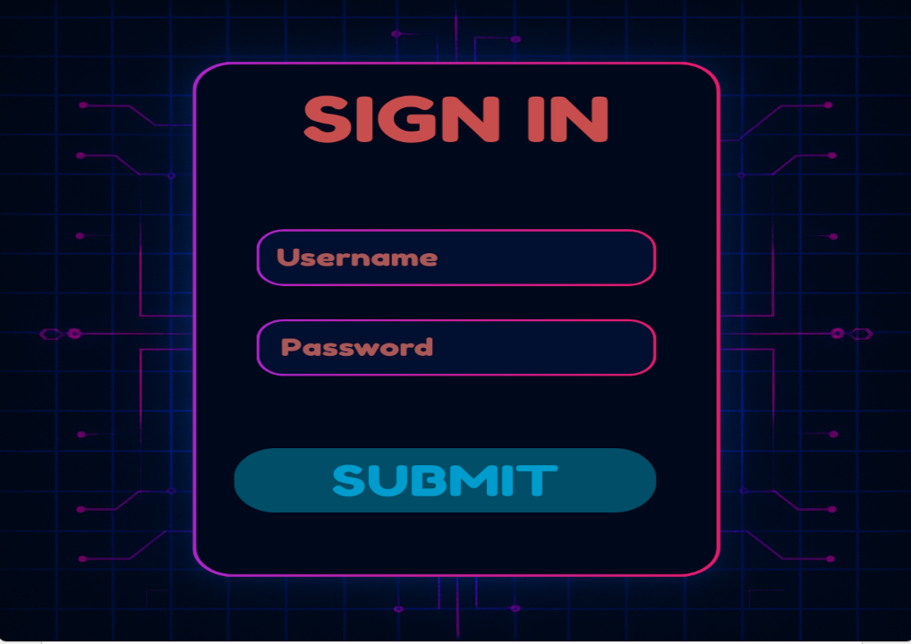

# XONIX - Data Structures Course Project

## About The Project

This project is a C++ implementation of the classic Xonix arcade game, developed as a core requirement for the **Data Structures Course** at **FAST University Islamabad**. A primary goal was to gain practical experience by **implementing fundamental data structures and several key game systems entirely from scratch**.

The game offers various features including different play modes, comprehensive user account management, data persistence, and competitive elements, built demonstrating the direct application of custom-coded data structures.

## Screenshots
For example:

## Features

The game includes the following main features, with several systems being custom-built as part of the course:

* **Core XONIX Gameplay:** The base mechanics of capturing territory by drawing lines while avoiding enemies.
* **Single-Player Mode:** A complete solo game experience with scoring and progression.
* **Local Multiplayer Mode:** Allows two players to play together on the same screen.
* **User Authentication System (Custom Built):** Handles player registration and secure login.
* **Player Profile System (Custom Built):** Manages individual player data including username, score, and win history.
* **Friend System (Custom Built):** Functionality to manage connections between players.
* **Save/Load Game Feature (Custom Built):** Ability to save single-player game progress and load it later.
* **Advanced Scoring System:** Detailed points system including bonuses for efficient capturing.
* **Power-Up System:** Introduces abilities that provide temporary advantages during gameplay.
* **Leaderboard (Custom Built):** Displays the top 10 players based on total accumulated points.
* **Matchmaking Simulation (Custom Built):** A conceptual system for pairing players for multiplayer games based on criteria.
* **Game Room Simulation (Custom Built):** A conceptual system managing matched players entering a game instance.
* **Inventory and Themes (Custom Built):** Allows players to browse and select different visual styles for the game.

## Custom Data Structures Used

As a central requirement for the Data Structures course, the following data structures were implemented from their basic principles and used to power the game's features:

* 2D Array (Used for the Game Board)
* Dynamic Array (Used for storing player objects and enemy objects)
* Linked List (Used within player profiles for friend lists)
* Hash Table (Used for fast player lookup by username)
* Min-Heap (Used for managing the Leaderboard)
* Queue (Used for Game Room simulation)
* Priority Queue (Used for Matchmaking simulation)
* AVL Tree (Used for Inventory/Themes)

## Built With

* C++
* SFML (Simple and Fast Multimedia Library)
* Custom Data Structures (Implemented from scratch)
* File Handling (For saving data like profiles and saves)

## Getting Started

To get the game running on your Windows machine using Visual Studio:

1.  **Download the project:** Download the project code as a ZIP file from this repository.
2.  **Extract:** Extract the ZIP file to a folder on your computer.
3.  **Open in Visual Studio:** Navigate to the extracted folder and double-click the `.sln` file (the Visual Studio Solution file). This will open the project in Visual Studio.
4.  **Select Release Mode:** In Visual Studio, find the configuration dropdown (usually near the top toolbar) and select **Release**. This builds the optimized version of the game.
5.  **Run:** 
This should build and run the game.

*(Note: This project relies on the SFML library. The Visual Studio solution is configured to find it, but you might need to ensure SFML is installed or located correctly relative to the project files on your system if you encounter build errors.)*

## Acknowledgements

* This project was completed for the **Data Structures Course** at **FAST University Islamabad**.
* Special thanks to my team member, **Taha Malik**.
* Thanks to the SFML team for the graphics and input library.
* [Any other individuals, resources, or professors you want to thank]

## License

Distributed under the **Creative Commons Attribution-NonCommercial 4.0 International Public License (CC BY-NC 4.0)**.

See the `LICENSE` file in the repository for the license text.